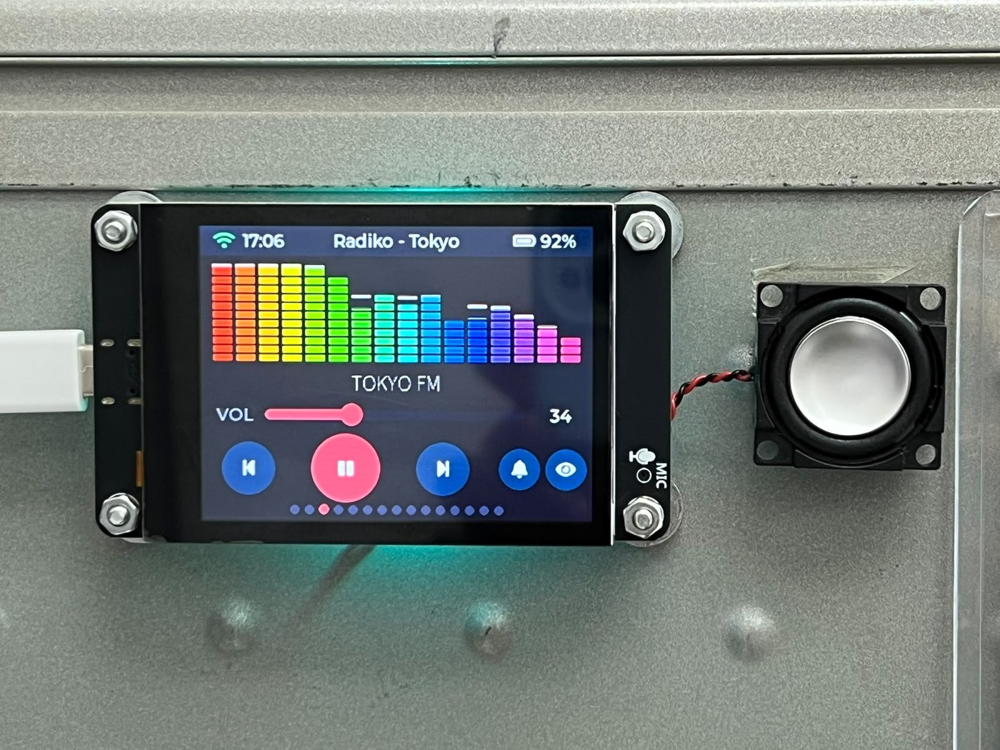

# ESP32 Radiko Player Pro

[English](README.md) | **日本語**

ESP32-S3 と **ESP-IDF** で一から自作した、タッチスクリーン式の [Radiko](https://radiko.jp/)(ラジコ)インターネットラジオです。**VPN を使わずに、海外から日本全国 47 都道府県の放送を受信できます。**


Radiko は日本国内からのアクセスに限定されており、通常は日本の VPN 経由で聴きます。このラジオに VPN は不要です。公式 Android アプリと同じ認証方式を用い、IP アドレスより優先される GPS 座標を送信することで、香港でも、世界のどこからでも、選んだ地域の放送を再生します。全 47 エリアの放送局リストとロゴは本体に内蔵しているため、エリア切り替えに待ち時間はありません。

ライブ HLS ストリームを取得し、HE-AAC を本体でデコードして I2S DAC から出力します。UI はすべて LVGL 製。`esp-adf` や巨大な SDK には依存せず、オーディオパイプラインは自前で実装・管理しています。

元は Arduino で動作していたプロジェクトを、**商用品質の組み込み開発**(初回コミットからの CI、デュアル OTA 構成、バージョン管理された NVS、構造化エラー処理など)を実践的に学ぶために ESP-IDF でゼロから再実装したものです。開発の全記録はフェーズごとに [PLAN.md](PLAN.md) にまとめてあり、**Lessons learned**(教訓)セクションは実際のデバッグ記録になっています。

## 画面

| | |
|---|---|
|  | **起動画面** — 実際のパイプラインの状態を表示し、音声が本当に鳴り始めた瞬間に消えます。 |
|  | **放送局リスト** — 実際の局ロゴと「現在オンエア中」の番組名(5 分ごとに更新)。エリアを変えると自動で再構築されます。 |
|  | **オーディオ・ビジュアライザー**(TOKYO FM で LED レインボー表示) — DAC に送られる音声のリアルタイム FFT。ロゴを長押しで 4 スタイルを切り替え。音声のバッファに応じて描画を制御し、再生を妨げません。 |
|  | **設定** — *Listen Area*(エリア選択、神奈川を表示)で 47 都道府県から選ぶと、その場で再認証してストリームを切り替えます。明るさ・自動オフ時間なども NVS に保存。 |
|  | **Wi-Fi 設定** — 画面上でスキャンし、電波強度順に表示。スキャンは LVGL スレッド外で実行し、UI は止まりません。 |
|  | **オンスクリーンキーボード** — パスワードは NVS に保存されるので、設定は一度きりです。 |

## 主な機能

- **VPN 不要のジオ認証** — Android アプリ方式(GPS が IP より優先)で、どの国からでも受信可能(香港から動作確認済み)
- **全国 47 エリア** — 画面上のエリア選択、各エリアの放送局リストとロゴを内蔵
- Wi-Fi 設定(画面上でスキャン＋パスワード入力)、認証情報は NVS に保存
- SNTP 時刻同期(JST) — Radiko 認証に必須
- Radiko `auth1`/`auth2`、ライブ HLS 再生(HE-AAC / `mp4a.40.5`, SBR)
- タッチ UI — フルスクリーンのロゴ、再生/一時停止、選局、音量、スリープタイマー、WS2812 ムード LED
- **リアルタイム・オーディオ・ビジュアライザー** — スペクトラム表示、ロゴ長押しで 4 スタイル切り替え(512 点 FFT、再生を妨げない設計)
- 番組情報(タイトル＋出演者)を再生画面とリスト各行に表示、全 CJK フォント対応
- 設定 — 明るさ、画面の減光/自動オフ、スリープタイマー、画面 180° 反転、スクリーンセーバー、システム情報(すべて NVS 保存)
- 自己修復フェイルスタック — タスクウォッチドッグ、コアダンプ、起動時クラッシュ要約、永続 W/E ログ(フラッシュリング)
- GitHub リリースからの **OTA アップデート**(自動ロールバック付き)
- タグ駆動の CI リリース(テスト → ビルド → **RSA-3072 署名** → 公開)
- **SD カードへの録音と再生** — ワンタップでライブ放送を micro-SD に `.aac` として録音(HLS セグメントが元々 AAC のためトランスコード無し)。オンデバイスプレーヤーで**ドラッグ操作の時間精度シーク**、選局(前/次)、音量、再生/一時停止、録音ごとの削除に対応。録音中は赤い「● REC m:ss」点滅と赤 LED 点灯。PC 不要で録音・再生できます。

## ハードウェア

**ボード:** lcdwiki ES3C28P — 画面・静電容量タッチ・オーディオコーデック＋アンプ・RGB LED・micro-SD スロット・バッテリー充電を 1 つの MCU にまとめた ~US$10〜15 の汎用 ESP32-S3 ボード(複数の名称で販売)。この統合ゆえに追加モジュール無しで自己完結型ラジオとして動作します。別途必要なのはスピーカーと Li-Po バッテリーだけです。

**コアモジュール — ESP32-S3 `N16R8`:** デュアルコア Xtensa LX7 @ 240 MHz、Wi-Fi b/g/n + BLE、**16 MB** QIO flash、**8 MB** Octal PSRAM。8 MB の PSRAM が 30 秒のオーディオリングバッファと大きな LVGL プールを可能にしています。書き込み・デバッグはネイティブ USB-Serial/JTAG。

**周辺機器マップ**(本ボードの配線):

| 機能 | 部品 | バス / ピン |
|---|---|---|
| ディスプレイ | ILI9341 2.8″ 320×240 | SPI — SCLK 12, MOSI 11、バックライト GPIO45 |
| タッチ | FT6336G 静電容量 | 共有 I²C — SDA 16, SCL 15 |
| コーデック | ES8311 (I²C 0x18) | I²S — MCLK 4, BCLK 5, WS 7, DOUT 8 |
| アンプ | FM8002E → スピーカー | GPIO1 でイネーブル(アクティブ Low) |
| RGB LED | WS2812B | GPIO42 |
| micro-SD | SDMMC 4-bit | CLK 38, CMD 40, D0 39, D1 41, D2 48, D3 47 |
| バッテリー | Li-ion + TP4054 充電 | ADC(GPIO9)で残量 |

ファームウェアを形づくった 2 点 — **micro-SD は LCD の SPI バスとは独立した専用 SDMMC ピン**にあるため録音と表示がピンを奪い合いません。そして本ボードの本当の制約は flash や CPU ではなく **内蔵 SRAM(約 512 KB)**です。Wi-Fi/TLS・タスクスタック・LVGL プール・LCD/SD の DMA バッファがすべてそこに収まる必要がある一方、8 MB の PSRAM はほぼ空いています。

⚠ 見た目が同じでも 8 MB flash や Quad PSRAM の製品があります。本プロジェクトは **16 MB flash + 8 MB Octal PSRAM**(モジュール刻印 `N16R8`)が必須です。入手のヒントとピン配置は [docs/board-lcdwiki-ES3C28P.md](docs/board-lcdwiki-ES3C28P.md) を参照してください。

## ビルドと書き込み

**ESP-IDF v5.3.5** が必要です。

```sh
. ~/esp/v5.3.5/esp-idf/export.sh      # ツールチェーンを読み込む
cd idf
idf.py set-target esp32s3             # 初回のみ
idf.py build
idf.py -p /dev/cu.usbmodem2101 flash monitor
```

Wi-Fi の認証情報は、初回起動時に gitignore 済みの `components/wifi/wifi_secrets.h`(`wifi_secrets.h.example` をコピー)から読み込むか、画面上で入力します。詳しいアーキテクチャやリリース手順は [英語版 README](README.md) を参照してください。

## キーワード

Radiko 自作 / ラジコ 受信機 / ESP32 ラジオ / ESP32-S3 インターネットラジオ / 海外から Radiko を聴く / VPN 不要 / エリア選択 / タイムフリー 録音 / SD カード 録音 / ESP-IDF / LVGL / HE-AAC / HLS

## ライセンス・注意

**学習目的のプロジェクトです。** Radiko の商標および利用規約、各放送局のロゴ商標を尊重してください。これは非公式クライアントであり、radiko.jp とは一切関係がありません。ライセンスの詳細は [LICENSE](LICENSE)、開発方針は [PLAN.md](PLAN.md) を参照してください。
