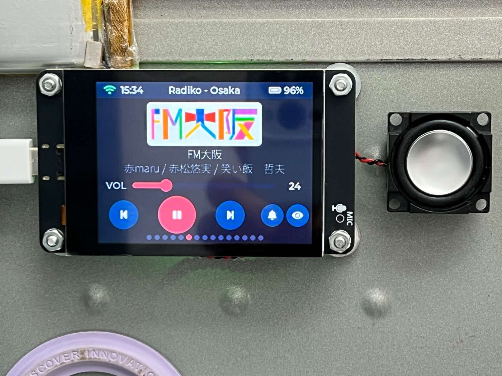
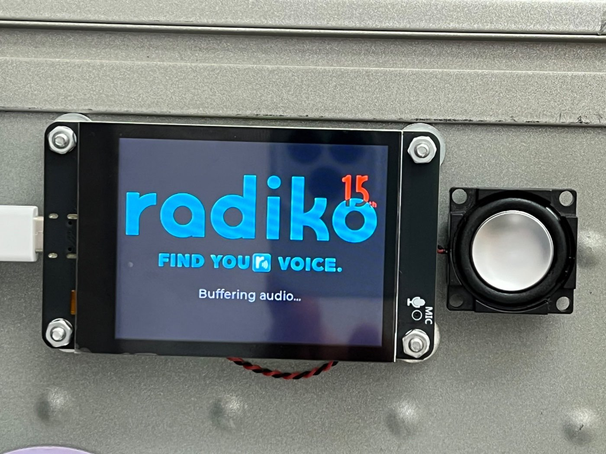
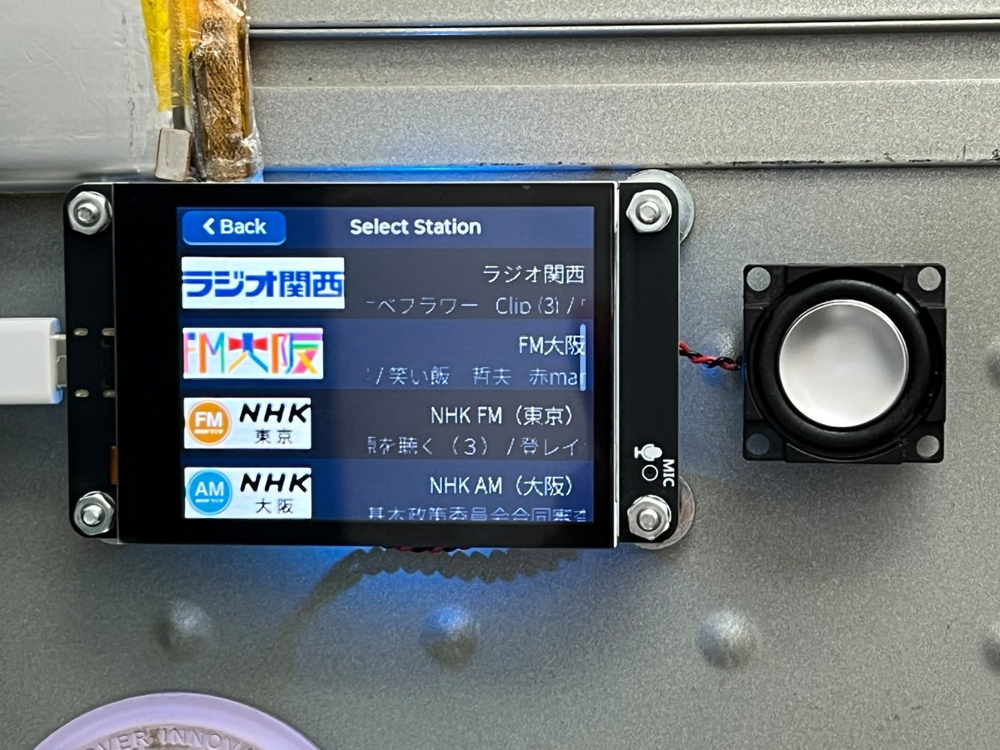
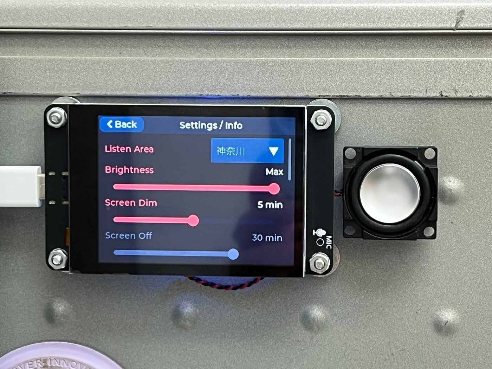
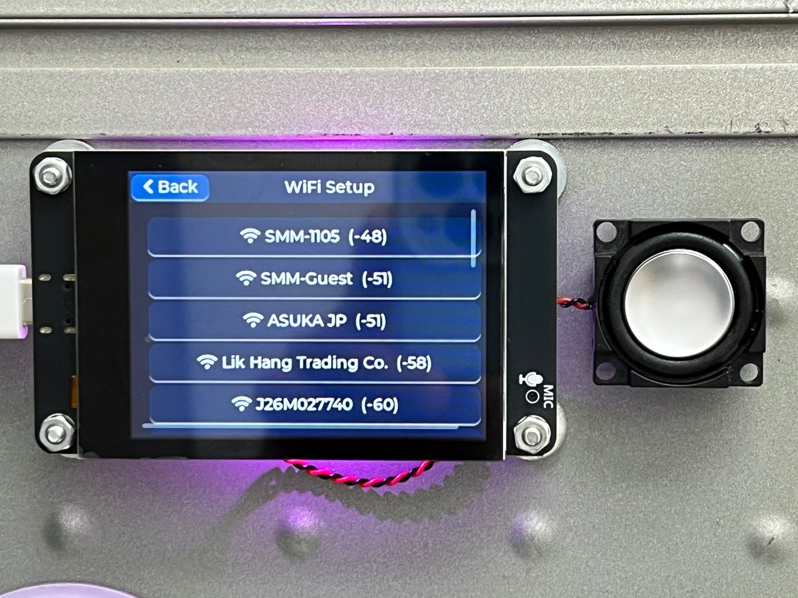
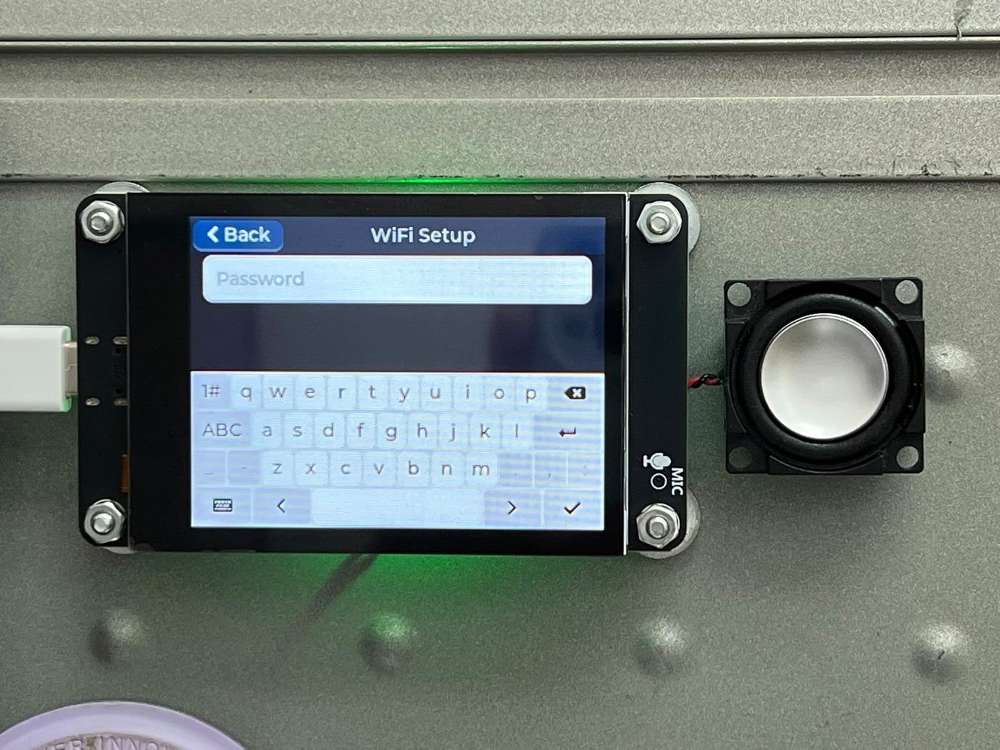

# s3-radiko-pro

A palm-sized touchscreen [Radiko](https://radiko.jp/) internet radio for the
ESP32-S3, built from scratch in **ESP-IDF** — and it streams **any of Japan's 47
prefectures from anywhere in the world, with no VPN**.



Radiko is geo-locked to Japan, and the usual answer is to tunnel your whole
network through a Japanese VPN. This radio doesn't need one: it authenticates the
way the official Android app does, which accepts a GPS coordinate that takes
precedence over your IP address. Pick a prefecture on-screen and that region's
stations play — from Hong Kong, or anywhere else. Station lists and logos for all
47 areas ship on the device, so switching regions needs no lookup.

It authenticates against Radiko, pulls the live HLS stream, decodes HE-AAC
on-device, and plays it through an I2S DAC — all driven by an LVGL touch UI. No
`esp-adf`, no vendored 250 MB SDK: the audio pipeline is hand-written and owned in
this repo.

This is a ground-up re-implementation of a working Arduino project, rebuilt as a
vehicle for learning commercial-grade embedded practices (CI from commit 0,
dual-OTA partition layout, versioned NVS, structured error handling). Progress is
tracked phase-by-phase in [PLAN.md](PLAN.md), whose **Lessons learned** section is
the running engineering log — including the bugs that bit hardest.

The repo holds **both** implementations, so the rebuild can be read against its
reference:

| | |
|---|---|
| [`idf/`](idf/) | the ESP-IDF firmware — **the live project**, everything below describes it |
| [`arduino/`](arduino/) | the original Arduino sketch — archived, superseded, no longer maintained |

## The radio

| | |
|---|---|
|  | **Boot splash** with live status — it waits on the real pipeline and clears the moment audio actually starts, so the screen never lies about being ready. |
|  | **Station list** — real broadcaster logos and each station's "now on air" programme, refreshed every 5 minutes. Rebuilt automatically when you change region. |
|  | **Settings** — the *Listen Area* picker (shown on 神奈川) selects any of the 47 prefectures in Japanese, then re-authenticates and restarts the stream in place. Brightness, dim/off timeouts and more, all NVS-persisted. |
|  | **Wi-Fi setup** — on-screen scan, sorted by signal strength. The scan runs off the LVGL thread so the UI never stalls. |
|  | **On-screen keyboard** for the password; credentials persist to NVS, so provisioning is a one-time job. |

## Status

Live Radiko audio plays, touchscreen-controlled. Working today:

- **No-VPN geo-auth**: Android-app authentication (GPS overrides IP), so any
  region streams from any country — verified streaming from Hong Kong
- **All 47 prefectures**: on-screen area picker (in Japanese); per-area station
  lists and every station's logo preloaded in flash partitions
- Wi-Fi provisioning (on-screen scan + password) with NVS-persisted credentials
- SNTP time sync (JST) — required for Radiko auth
- Radiko `auth1`/`auth2` and live HLS playback (HE-AAC / `mp4a.40.5`, SBR)
- Player UI (Arduino-parity): swipeable full-width logo, play/pause, prev/next,
  volume, sleep timer, WS2812 mood-LED modes
- "Now on air" program info (title + performers) on the player and per list row,
  full-CJK font, refreshed every 5 min
- Settings page: brightness, screen dim/off timeouts, sleep timer, flip-180°,
  screen saver, system/firmware info — all NVS-persisted
- Screen saver (DVD-style bouncing clock) and battery gauge (ADC, status-bar %)
- Instant pause/switch, debounced station navigation, persisted station & volume
- Boot splash with live status, dismissed when audio actually starts
- Self-healing failure stack: task-watchdog panics on wedges, coredump +
  boot-time crash summary, persistent W/E event log (flash ring)
- OTA updates from GitHub releases with automatic bootloader rollback
  (Settings ▸ Check for Update); parsers covered by host unit tests + CI
- Tag-driven CI release pipeline: test → build → **RSA-3072 sign** → publish
- Optional signed-OTA enforcement profile (Phase 25 Stage A); JTAG live-debug

**All 25 planned phases complete**, plus Tier E extras: VPN-free multi-area
geo-auth (Phase 30) and an LVGL heap fix (Phase 31). The hardware secure-boot /
flash-encryption burn (Phase 25 Stage B) is documented as a factory-ready runbook
but deliberately not executed on this single in-use board — see
[docs/secure-boot-runbook.md](docs/secure-boot-runbook.md) for the reasoning.
Optional polish ideas (localization, EQ, Bluetooth output) live in
[PLAN.md](PLAN.md) Tier E.

## Hardware

**Board:** lcdwiki ES3C28P — ESP32-S3 (16 MB QIO flash, 8 MB OPI PSRAM), ILI9341
320×240 SPI LCD, FT6336G capacitive touch, ES8311 codec + FM8002E amp. A generic
~US$10–15 board sold under several names; a speaker and LiPo battery are extra.

**Want to build one?** [Getting one](docs/board-lcdwiki-ES3C28P.md#getting-one)
lists the search terms and — more importantly — the specs to match. Boards that
look identical ship with 8 MB flash or Quad PSRAM, and this project needs
**16 MB flash + 8 MB Octal PSRAM** (module marked `N16R8`).

Full pin map and panel quirks: [docs/board-lcdwiki-ES3C28P.md](docs/board-lcdwiki-ES3C28P.md).

## Build & flash

Requires **ESP-IDF v5.3.5**.

```sh
. ~/esp/v5.3.5/esp-idf/export.sh      # source the toolchain
cd idf
idf.py set-target esp32s3             # first time only
idf.py build
idf.py -p /dev/cu.usbmodem2101 flash monitor
```

Wi-Fi credentials seed from a gitignored `components/wifi/wifi_secrets.h` on first
boot (copy `wifi_secrets.h.example`), or enter them on-screen. `sdkconfig` is
generated and gitignored — the committed deltas live in `idf/sdkconfig.defaults`.

**Releases & updates:** bump `PROJECT_VER` in `idf/CMakeLists.txt`, tag `vX.Y.Z`,
push the tag — CI tests, builds, **RSA-3072 signs**, and publishes the release.
Devices update from Settings ▸ Check for Update (A/B slots, automatic bootloader
rollback if the new image fails its 30 s self-test). USB flashing always remains
the recovery path.

**Signed firmware (Phase 25 Stage A, optional profile):** signed releases boot
on any build; a radio flashed with the signed profile *rejects* unsigned OTA
images. It's a switchable overlay — the default build is unchanged:

```sh
idf.py build                                                # default: accepts any image
idf.py -B build_signed -DSDKCONFIG="build_signed/sdkconfig" \
       -DSDKCONFIG_DEFAULTS="sdkconfig.defaults;sdkconfig.signed" build   # enforces signatures
```

Hardware enforcement (secure boot + flash encryption, the irreversible eFuse
burn) is written up but **not executed** — see
[docs/secure-boot-runbook.md](docs/secure-boot-runbook.md).

## Architecture (short version)

Two-stage streaming pipeline: a **fetcher** task keeps a queue of AAC segments
full while a **decoder** task drains it through libhelix into a 30-second PCM
ring buffer that an I2S writer feeds to the DAC. Both live on core 0 with the
rest of the networking; core 1 belongs to LVGL and the I2S writer alone. This
decoupling is what makes live playback keep up with a CDN that serves segments
at ~1× real time and ride through Radiko's ~5-minute session re-resolves.

Task/core/priority map, the internal-RAM-vs-PSRAM memory budget, and the full
data flow are in [docs/architecture.md](docs/architecture.md). Debugging the
board (USB-JTAG recovery, coredumps, serial capture) is in
[docs/debugging.md](docs/debugging.md).

## Repository layout

```
README.md            you are here
LICENSE              MIT
PLAN.md              roadmap + engineering log (Lessons learned)
docs/                board reference, architecture, debugging runbook
  images/            photos of the radio, used by this README
assets/              source art (splash logo) consumed by tools/
idf/                 THE FIRMWARE — ESP-IDF project, build from here
  main/              app entry + init sequence
  components/        one component per concern:
    display  ui  fonts  logos  stations   — screen + assets (LVGL v9)
    touch  i2c_bus                          — input
    wifi  timesync  httpc  radiko           — network + auth
    stream  libhelix_aac  audio             — HLS pipeline + decode + I2S
    settings  led  battery                  — versioned NVS config, mood LED, gauge
    app_watchdog  crashlog  elog  ota       — watchdog policy, post-mortem, event log, updates
  sdkconfig.defaults partitions.csv         — build config, dual-OTA flash map
arduino/             the original sketch — ARCHIVED reference, not maintained
test/host/           Unity unit tests for the parsers (run locally, pre-push, and in CI)
tools/               asset generators (station DB, splash) + elog dump
.githooks/           pre-push gate — enable with: git config core.hooksPath .githooks
.github/workflows/   CI per push (tests + firmware build); tag-driven releases (vX.Y.Z)
```

## Licensing notes

- `components/libhelix_aac/` vendors the **Helix AAC** decoder under the RealNetworks
  Public Source License (RPSL) — see that directory.
- Station logos are the trademarks of their respective broadcasters, embedded here
  for a personal, non-commercial reproduction of the physical radio's UI.
- Japanese text uses [Noto Sans JP](https://fonts.google.com/noto/specimen/Noto+Sans+JP)
  (SIL Open Font License). The archived `arduino/` sketch instead uses Hiragino,
  an Apple system font that is **not** redistributable — see
  [arduino/README.md](arduino/README.md) before reusing that code.
- Original Arduino project by the author; this ESP-IDF rebuild is the same author's.
